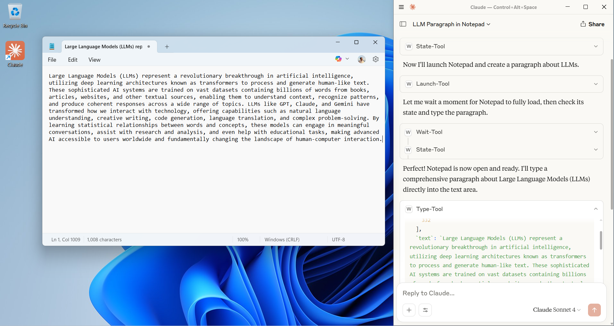
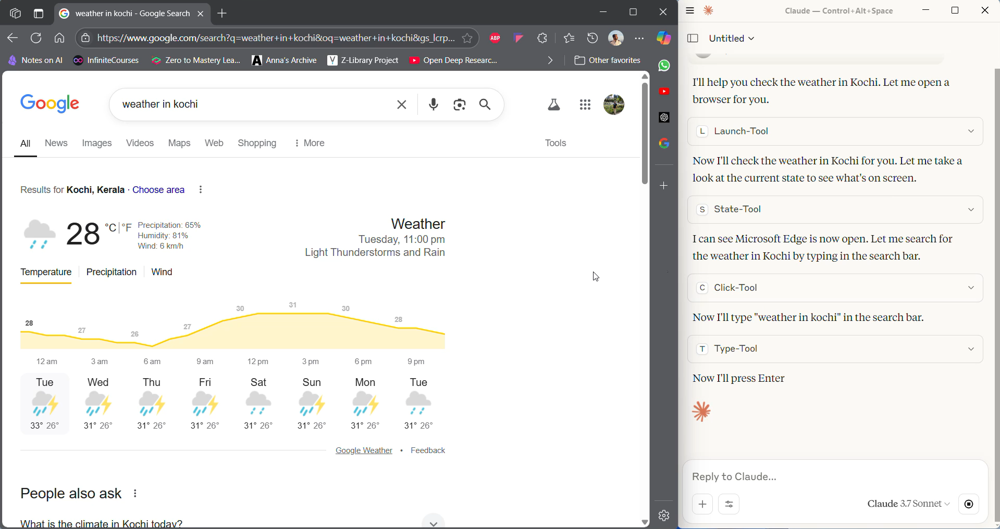

# Windows MCP.Net

[English](README.en.md) | **中文**

一个基于 .NET 的 Windows 桌面自动化 MCP (Model Context Protocol) 服务器，为 AI 助手提供与 Windows 桌面环境交互的能力。

## 📋 目录

- [功能特性](#-功能特性)
- [演示截图](#-演示截图)
- [技术栈](#️-技术栈)

- [API文档](#-api-文档)
- [项目结构](#️-项目结构)
- [功能扩展建议](#-功能扩展建议)
- [配置](#-配置)
- [贡献指南](#-贡献指南)
- [更新日志](#-更新日志)
- [支持](#-支持)

## 🚀 快速开始

### 前置要求
- Windows 操作系统
- .NET 10.0 Runtime 或更高版本

**重要提示**: 本项目需要 .NET 10 才能运行，请先确保你的本地安装了 .NET 10。如果尚未安装，请访问 [.NET 10 下载页面](https://dotnet.microsoft.com/zh-cn/download/dotnet/10.0) 进行下载和安装。

### 1. 安装和运行

#### 方式一：全局安装（推荐）
```bash
dotnet tool install --global WindowsMCP.Net
```

#### 方式二：从源码运行
```bash
# 克隆仓库
git clone https://github.com/AIDotNet/Windows-MCP.Net.git
cd Windows-MCP.Net

# 构建项目
dotnet build

# 运行项目
dotnet run --project src/Windows-MCP.Net.csproj
```

### 2. MCP 客户端配置

在您的 MCP 客户端配置中添加以下配置：

#### 使用全局安装的工具（推荐）
```json
{
    "mcpServers": {
     "Windows-MCP.Net": {
      "type": "stdio",
      "command": "dnx",
      "args": ["Windows-MCP.Net@", "--yes"],
      "env": {}
    }
    }
}
```

#### 使用项目源码直接运行（开发模式）

**方式一：工作区配置**

在项目根目录创建 `.vscode/mcp.json` 文件：
```json
{
  "mcpServers": {
    "Windows-MCP.Net-Dev": {
      "type": "stdio",
      "command": "dotnet",
      "args": ["run", "--project", "src/Windows-MCP.Net.csproj"],
      "cwd": "${workspaceFolder}",
      "env": {}
    }
  }
}
```

**方式二：用户配置**

通过VS Code命令面板运行 `MCP: Open User Configuration`，添加：
```json
{
  "mcpServers": {
    "Windows-MCP.Net-Local": {
      "type": "stdio",
      "command": "dotnet",
      "args": ["run", "--project", "src/Windows-MCP.Net.csproj"],
      "env": {}
    }
  }
}
```

> **注意**: 使用项目源码方式便于开发调试，修改代码后无需重新安装即可生效。VS Code 1.102+ 版本支持MCP服务器的自动发现和管理。

### 2. 安装和运行

#### 方式一：全局安装（推荐）
```bash
dotnet tool install --global WindowsMCP.Net
```

#### 方式二：从源码运行
```bash
# 克隆仓库
git clone https://github.com/AIDotNet/Windows-MCP.Net.git
cd Windows-MCP.Net

# 构建项目
dotnet build

# 运行项目
dotnet run --project src/Windows-MCP.Net.csproj
```

### 3. 开始使用
配置完成后，重启您的MCP客户端，即可开始使用Windows桌面自动化功能！

## 🚀 功能特性

### 核心功能
- **应用程序启动**: 通过名称从开始菜单启动应用程序
- **PowerShell 集成**: 执行 PowerShell 命令并返回结果
- **桌面状态捕获**: 获取当前桌面状态，包括活动应用、UI 元素等
- **剪贴板操作**: 复制和粘贴文本内容
- **鼠标操作**: 点击、拖拽、移动鼠标光标
- **键盘操作**: 文本输入、按键操作、快捷键组合
- **窗口管理**: 调整窗口大小、位置，切换应用程序
- **滚动操作**: 在指定坐标进行滚动操作
- **网页抓取**: 获取网页内容并转换为 Markdown 格式
- **浏览器操作**: 在默认浏览器中打开指定URL
- **截图功能**: 截取屏幕并保存到临时目录
- **文件系统操作**: 文件和目录的创建、读取、写入、复制、移动、删除等操作
- **OCR文字识别**: 从屏幕或指定区域提取文字，查找文字位置
- **等待控制**: 在操作间添加延迟

### 支持的工具

## Desktop 桌面操作工具

| 工具名称 | 功能描述 |
|---------|----------|
| **LaunchTool** | 从开始菜单启动应用程序 |
| **PowershellTool** | 执行 PowerShell 命令并返回状态码 |
| **StateTool** | 捕获桌面状态信息，包括应用程序和UI元素 |
| **ClipboardTool** | 剪贴板复制和粘贴操作 |
| **ClickTool** | 鼠标点击操作（支持左键、右键、中键，单击、双击、三击） |
| **TypeTool** | 在指定坐标输入文本，支持清除和回车 |
| **ResizeTool** | 调整窗口大小和位置 |
| **SwitchTool** | 切换到指定应用程序窗口 |
| **ScrollTool** | 在指定坐标或当前鼠标位置滚动 |
| **DragTool** | 从源坐标拖拽到目标坐标 |
| **MoveTool** | 移动鼠标光标到指定坐标 |
| **ShortcutTool** | 执行键盘快捷键组合 |
| **KeyTool** | 按下单个键盘按键 |
| **WaitTool** | 暂停执行指定秒数 |
| **ScrapeTool** | 抓取网页内容并转换为Markdown格式 |
| **ScreenshotTool** | 截取屏幕并保存到临时目录，返回图片路径 |
| **OpenBrowserTool** | 在默认浏览器中打开指定URL |

## FileSystem 文件系统工具

| 工具名称 | 功能描述 |
|---------|----------|
| **ReadFileTool** | 读取指定文件的内容 |
| **WriteFileTool** | 向文件写入内容 |
| **CreateFileTool** | 创建新文件并写入指定内容 |
| **CopyFileTool** | 复制文件到指定位置 |
| **MoveFileTool** | 移动或重命名文件 |
| **DeleteFileTool** | 删除指定文件 |
| **GetFileInfoTool** | 获取文件信息（大小、创建时间等） |
| **ListDirectoryTool** | 列出目录中的文件和子目录 |
| **CreateDirectoryTool** | 创建新目录 |
| **DeleteDirectoryTool** | 删除目录及其内容 |
| **SearchFilesTool** | 在指定目录中搜索文件 |

## OCR 图像识别工具

| 工具名称 | 功能描述 |
|---------|----------|
| **ExtractTextFromScreenTool** | 使用OCR从整个屏幕提取文字 |
| **ExtractTextFromRegionTool** | 使用OCR从屏幕指定区域提取文字 |
| **FindTextOnScreenTool** | 使用OCR在屏幕上查找指定文字 |
| **GetTextCoordinatesTool** | 获取屏幕上文字的坐标位置 |

## UI元素识别工具

| 工具名称 | 功能描述 |
|---------|----------|
| **FindElementByTextTool** | 通过文本内容查找UI元素 |
| **FindElementByClassNameTool** | 通过类名查找UI元素 |
| **FindElementByAutomationIdTool** | 通过自动化ID查找UI元素 |
| **GetElementPropertiesTool** | 获取指定坐标元素的属性信息 |
| **WaitForElementTool** | 等待指定元素出现在界面上 |

## 📸 演示截图

### 文本输入演示
通过 TypeTool 在记事本中自动输入文本：



### 网页搜索演示
使用 ScrapeTool 打开并搜索网页内容：



### 📹 演示视频
完整的桌面自动化操作演示：

[网页搜索演示](assets/video.mp4)

## 🛠️ 技术栈

- **.NET 10.0**: 基于最新的 .NET 框架
- **Model Context Protocol**: 使用 MCP 协议进行通信
- **Microsoft.Extensions.Hosting**: 应用程序托管框架
- **Serilog**: 结构化日志记录
- **HtmlAgilityPack**: HTML 解析和网页抓取
- **ReverseMarkdown**: HTML 到 Markdown 转换


## 📖 API 文档

### 示例操作

#### 启动应用程序
```json
{
  "tool": "LaunchTool",
  "parameters": {
    "name": "notepad"
  }
}
```

#### 点击操作
```json
{
  "tool": "ClickTool",
  "parameters": {
    "x": 100,
    "y": 200,
    "button": "left",
    "clicks": 1
  }
}
```

#### 文本输入
```json
{
  "tool": "TypeTool",
  "parameters": {
    "x": 100,
    "y": 200,
    "text": "Hello, World!",
    "clear": false,
    "pressEnter": false
  }
}
```

#### 获取桌面状态
```json
{
  "tool": "StateTool",
  "parameters": {
    "useVision": false
  }
}
```

#### 截取屏幕
```json
{
  "tool": "ScreenshotTool",
  "parameters": {}
}
```

## 🏗️ 项目结构

```
src/
├── .mcp/                 # MCP 服务器配置
├── Exceptions/           # 自定义异常类
├── Models/              # 数据模型
├── Prompts/             # 提示模板
├── Services/            # 核心服务
│   ├── DesktopService.cs    # 桌面操作服务实现
│   └── IDesktopService.cs   # 桌面服务接口
├── Tools/               # MCP 工具实现
│   ├── ClickTool.cs         # 点击工具
│   ├── LaunchTool.cs        # 启动工具
│   ├── TypeTool.cs          # 输入工具
│   └── ...                  # 其他工具
├── Program.cs           # 程序入口点
├── Windows-MCP.Net.csproj   # 项目文件
└── Windows-MCP.Net.sln      # 解决方案文件
```

## 🚧 功能扩展建议

### 计划中的功能

#### 高级UI识别与交互
- **UI元素识别增强**: 支持更多UI框架（WPF、WinForms、UWP）
- **OCR文字识别优化**: 多语言支持，提升识别准确率
- **智能等待机制**: 动态等待元素加载完成

#### 文件系统操作增强
- **高级文件搜索**: 支持内容搜索、正则表达式匹配
- **批量文件操作**: 支持批量复制、移动、重命名
- **文件监控**: 实时监控文件系统变化

#### 系统监控与性能分析
- **系统资源监控**: CPU、内存、磁盘、网络使用情况
- **进程管理**: 进程列表获取、性能监控、进程控制
- **性能分析报告**: 生成详细的系统性能报告

#### 多媒体处理能力
- **音频控制**: 系统音量控制、音频设备管理
- **图像处理**: 图片缩放、裁剪、格式转换
- **屏幕录制**: 支持屏幕录制和回放

#### 网络与通信功能
- **网络诊断**: Ping、端口扫描、连通性测试
- **HTTP客户端**: 支持RESTful API调用
- **WiFi管理**: WiFi网络扫描和连接管理

#### 安全性与权限管理
- **权限检查**: 用户权限验证和管理
- **数据加密**: 敏感数据加密存储
- **操作审计**: 完整的操作日志和审计追踪

### 开发路线图

#### 第一阶段（高优先级）- 核心功能增强
- ✅ UI元素识别工具（已完成Windows API实现）
- 🔄 文件管理工具增强
- 📋 系统监控工具
- 🔒 基础安全工具

#### 第二阶段（中优先级）- 功能扩展
- 📋 OCR文字识别优化
- 📋 高级文件搜索
- 📋 音频控制工具
- 📋 网络诊断工具
- 📋 Excel操作支持

#### 第三阶段（低优先级）- 高级功能
- 📋 图像处理工具
- 📋 任务调度系统
- 📋 数据库操作支持
- 📋 宏录制与回放

## 🔧 配置

### 日志配置

项目使用 Serilog 进行日志记录，日志文件保存在 `logs/` 目录下：

- 控制台输出：实时日志显示
- 文件输出：按天滚动，保留 31 天
- 日志级别：Debug 及以上

### 环境变量

| 变量名 | 描述 | 默认值 |
|--------|------|--------|
| `ASPNETCORE_ENVIRONMENT` | 运行环境 | `Production` |

## 📝 许可证

本项目基于 MIT 许可证开源。详情请参阅 [LICENSE](LICENSE) 文件。

## 🔗 相关链接

- [Model Context Protocol](https://modelcontextprotocol.io/)
- [.NET 文档](https://docs.microsoft.com/dotnet/)
- [Windows API 文档](https://docs.microsoft.com/windows/win32/)

## 🤝 贡献指南

我们欢迎社区贡献！如果您想为项目做出贡献，请遵循以下步骤：

### 开发环境设置

1. **克隆仓库**
   ```bash
   git clone https://github.com/AIDotNet/Windows-MCP.Net.git
   cd Windows-MCP.Net
   ```

2. **安装依赖**
   ```bash
   dotnet restore
   ```

3. **运行测试**
   ```bash
   dotnet test
   ```

4. **构建项目**
   ```bash
   dotnet build
   ```

### 贡献流程

1. Fork 本仓库
2. 创建功能分支 (`git checkout -b feature/AmazingFeature`)
3. 提交更改 (`git commit -m 'Add some AmazingFeature'`)
4. 推送到分支 (`git push origin feature/AmazingFeature`)
5. 创建 Pull Request

### 代码规范

- 遵循 C# 编码规范
- 为新功能添加单元测试
- 更新相关文档
- 确保所有测试通过

### 问题报告

在报告问题时，请提供：
- 操作系统版本
- .NET 版本
- 详细的错误信息
- 重现步骤

## 📞 支持

如果您遇到问题或有建议，请：

1. 查看 [Issues](https://github.com/xuzeyu91/Windows-MCP.Net/issues)
2. 创建新的 Issue
3. 参与讨论
4. 查看 [Wiki](https://github.com/xuzeyu91/Windows-MCP.Net/wiki) 获取更多帮助
---

**注意**: 本工具需要适当的 Windows 权限来执行桌面自动化操作。请确保在受信任的环境中使用。

**免责声明**: 使用本工具进行自动化操作时，请遵守相关法律法规和软件使用协议。开发者不承担因误用工具而产生的任何责任。
